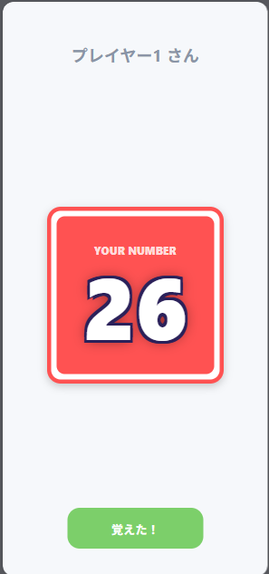
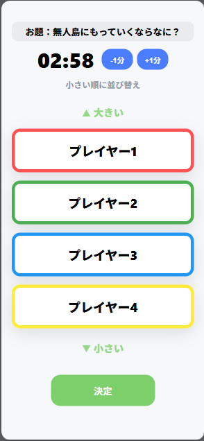
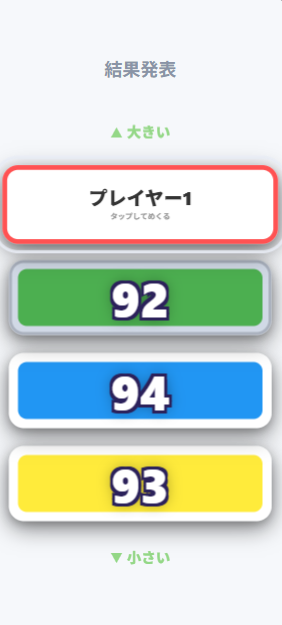

# 価値観当てゲーム Web App (1台完結版)

1台のスマホで遊べる「」アプリです。1〜100の数字を各プレイヤーにランダム配布し、お題に合わせて表現して並べるゲームをサポートします。

サーバー不要・無料で運用可能なWebアプリです。

## 📸 プレイ画面

| 数字確認 | 推測して並び替え | 結果画面 |
| :---: | :---: | :---: |
|  |  |  |


---

## 🎮 遊び方

1. **人数とお題を設定**: プレイヤー人数と相談時間（シンキングタイム）を決めます。
2. **数字を確認**: 順番にスマホを回して、覗き見防止のカードをタップして自分の数字を確認します。
3. **シンキングタイム**: お題に沿って全員で会話しながら、数字の大きさを推測し合います。
4. **並び替え**: 相談した結果をもとに、数字が小さいと思う順にプレイヤーを選択します。
5. **答え合わせ**: 並べた順に数字を公開し、すべて昇順ならクリア！

---

## ✨ 機能

- **1〜100の重複なしランダム配布**: 2〜10人まで対応。
- **覗き見防止モード**: タップで反転するカード形式で、個別に数字を確認可能。
- **お題入力**: 自由に今日のお題を設定できます。
- **可変タイマー**: シンキングタイムを1分〜30分で設定可能。
- **クリア判定**: 並べた順序が正しいか自動で判定します。
- **PWA対応**: ホーム画面に追加してオフラインでも動作します。

---

## 🛠 技術構成

- **HTML5 / CSS3 / JavaScript (Vanilla)**
- **Single File Structure**: 読み込みの安定性と配布のしやすさを考慮し、`index.html` 1ファイルに統合。
- **Service Worker**: PWA化とオフラインキャッシュ。
- **LocalStorage**: ブラウザに設定を保持（今後の拡張予定）。

---

## 📂 ディレクトリ構成

```text
価値観当てゲーム/
├── index.html      # 本体（HTML/CSS/JS統合版）
├── manifest.json   # PWA設定
├── sw.js           # オフライン動作制御
├── favicon.svg     # アイコン
└── README.md       # 本ファイル
```

---

## 📱 PWAとして使う方法

1. ブラウザでアプリを開く。
2. ブラウザメニューから「ホーム画面に追加」を選択。
3. アプリとしてインストールされ、オフラインでも起動できます。

---

## 📜 ライセンス

MIT License
自由に改造・配布OK

Enjoy 価値観当てゲーム 🎉
